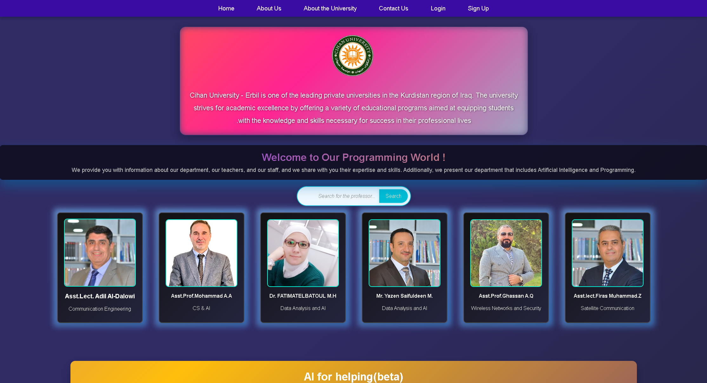
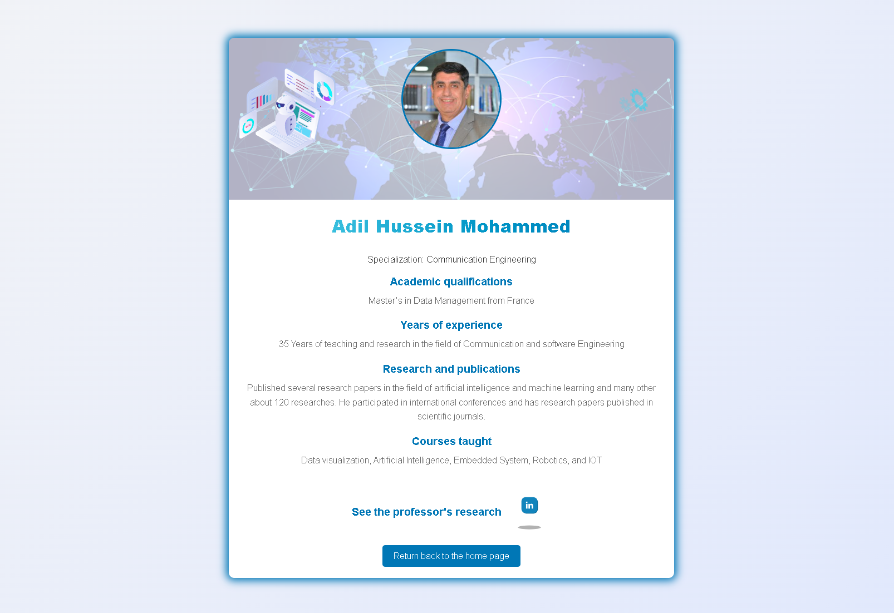
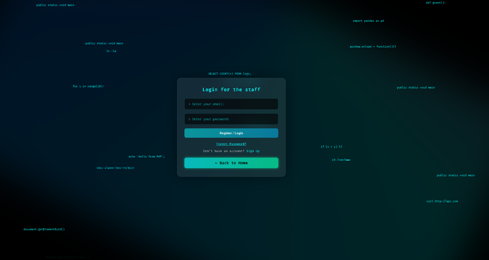

# 🎓 ISEDEP — Department Website & Digital ID Portal

A full website for the **Informatics & Software Engineering Department (ISE)** at Cihan University-Erbil — [isedep.com](https://isedep.com) — with staff profile pages, an authentication system, and an animated digital ID card experience.

## 📱 Screenshots

| Homepage | Staff Profile | Digital ID Login |
|:---:|:---:|:---:|
|  |  |  |

## ✨ Features

- 🪪 **Animated digital ID login** — a stylized, robot-themed login/sign-in experience
- 🔐 **Full authentication flow** — register, login, forgot password (identity-verified via name + gender match), and secure token-based password reset
- 👨‍🏫 **Staff profile cards** — individual pages for department faculty with photos and bios
- 📧 **Transactional email** — password-reset links and contact-form messages sent via PHPMailer (Gmail SMTP) / PHP `mail()`
- 🌐 **Multi-language support** — client-side translation via `translate.js`
- 📱 **Responsive, animated UI** — gradient backgrounds, card layouts, custom CSS/JS

## 🛠️ Tech Stack

- **Frontend:** HTML5, CSS3, vanilla JavaScript
- **Backend:** PHP (PDO + MySQL)
- **Email:** PHPMailer (SMTP) and native PHP `mail()`
- **Auth security:** bcrypt password hashing, random-token password resets with expiry, identity verification on recovery

## 📁 Project Structure

```
index.html                     # homepage
login.html / login.php         # authentication
signup.html / register.php     # account creation
forgot-password.html / .php    # password recovery (identity verification)
reset-password.php             # token-based password reset
animated_robot_login.html      # animated digital ID login experience
cards.html                     # staff directory
adil.html, fatima.html,
firas.html, ghasan.html,
mohamed.html, yazen.html       # individual staff profile pages
about-us.html, about-uni.html  # informational pages
contact.html                   # contact form
mailer.php                     # PHPMailer SMTP wrapper
sending_email.php              # simple contact-form mailer
config.php                     # database connection (see config.example.php)
translate.js                   # client-side language switcher

images/                        # all site images & media, one place
├── cihan-logo.png
├── adil-hussain-mohammed.jpg
├── mohammad-anwar-assaad.jpg
├── yazan-saif-aldeen-mahmood.jpg
├── fatima-photo.jfif
├── firas-photo.jpg
├── ghasan-photo.jpg
├── f-coder.png / m-coder.png  # gender-selection icons (signup)
├── networking-icon.png
├── world-map-background.avif
└── correct-answer-tone.wav
```

## 🚀 Getting Started

1. Copy the config templates and fill in your own credentials:
   ```bash
   cp config.example.php config.php
   cp mailer.example.php mailer.php
   ```
2. Create a MySQL database with a `users` table (`id`, `full_name`, `email`, `password`, `role`, `department`, `gender`, `reset_token`, `token_expires`) and a `password_resets` table (`email`, `token`, `expires_at`).
3. Install PHPMailer via Composer:
   ```bash
   composer require phpmailer/phpmailer
   ```
4. Serve with any PHP-enabled web server (e.g. `php -S localhost:8000`) pointed at this folder.

## 👤 Author

**Abdullah Baban** — Informatics & Software Engineer
[LinkedIn](https://linkedin.com/in/abdullah-baban-9714b6424) · [GitHub](https://github.com/abdulla-sardar)
